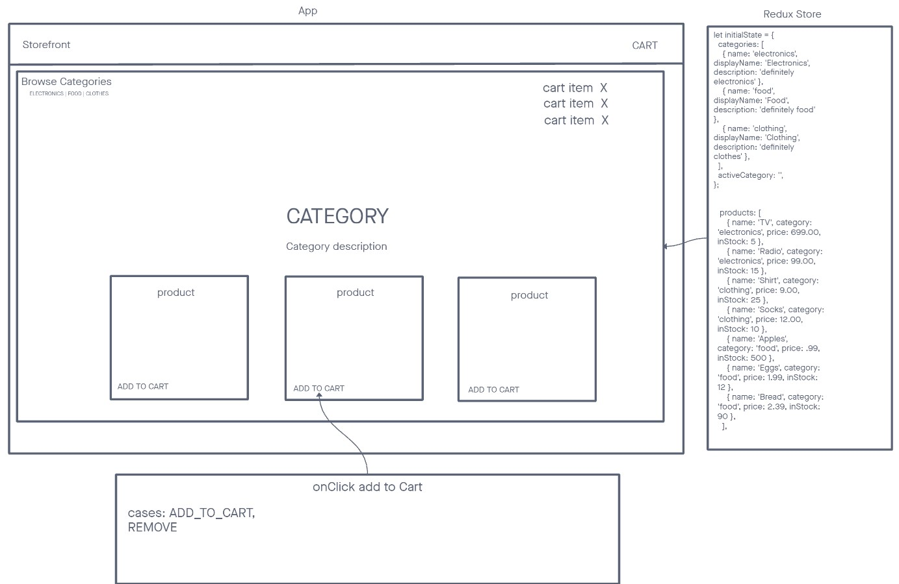
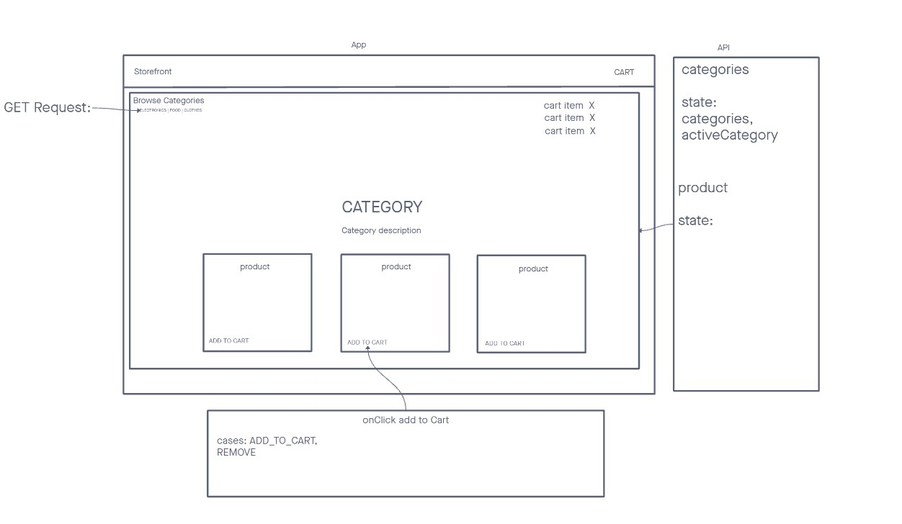

# Storefront

In **Phase 1** our goal is to setup the basic scaffolding of the application with initial styling and basic behaviors. This initial build sets up the file structure and state management so that we can progressively build this application in a scalable manner.

The following user/developer stories detail the major functionality for this phase of the project.

- As a user, I expect to see a list of available product categories in the store so that I can easily browse products.

- As a user, I want to choose a category and see a list of all available products matching that category.

- As a user, I want a clean, easy to use user interface so that I can shop the online store with confidence.

In **phase 2**, we will be adding the “Add to Cart” feature to our application, which will allow our users to not only browse items in the store, but also select them and have them persist in their “shopping cart” for later purchase.

- As a user, I want to choose from products in the list and add them to my shopping cart.

- As a user, I want to see the products that I’ve added to my shopping cart in a growing list on the side of the page”.

- As a user, I want to change the quantity of items I intend to purchase in the header. i.e. CART (1)

- As a user, I want to be able to remove an item from my shopping cart.

In **phase 3**, we will be connecting our Virtual Store to a live API so that our data is persistent and able to be separately managed.

- As a user, I want to interact with live inventory so that I have confidence that the displayed products are in stock.

- As a user, I want to know to that when I add an item to my cart, that it is removed from inventory so that no other users can purchase it.

In **phase 4**, we will be completing work on our Virtual Store by adding two full page views to the application: Product Details and Checkout.

- As a user, I want to see a full detail view of a product so that I can make a more informed choice about purchasing it.

- As a user, I want to view my full cart and initiate the checkout process so that I can purchase my items and have them delivered.

## Collaboration

- Demo Code
- Ike
- Reece
- Nick M.
- Ryan E.

## Links and Resources

- [GitHub Actions](https://github.com/KaedenOC/storefront/actions)
- [Sandbox Lab 36](https://codesandbox.io/p/github/KaedenOC/storefront/redux2?layout=%257B%2522sidebarPanel%2522%253A%2522EXPLORER%2522%252C%2522rootPanelGroup%2522%253A%257B%2522direction%2522%253A%2522horizontal%2522%252C%2522type%2522%253A%2522PANEL_GROUP%2522%252C%2522id%2522%253A%2522ROOT_LAYOUT%2522%252C%2522panels%2522%253A%255B%257B%2522type%2522%253A%2522PANEL_GROUP%2522%252C%2522direction%2522%253A%2522horizontal%2522%252C%2522id%2522%253A%2522EDITOR%2522%252C%2522panels%2522%253A%255B%257B%2522type%2522%253A%2522PANEL%2522%252C%2522panelType%2522%253A%2522TABS%2522%252C%2522id%2522%253A%2522cljswmld400sf356m0y1cmxud%2522%257D%255D%252C%2522sizes%2522%253A%255B100%255D%257D%252C%257B%2522type%2522%253A%2522PANEL_GROUP%2522%252C%2522direction%2522%253A%2522horizontal%2522%252C%2522id%2522%253A%2522DEVTOOLS%2522%252C%2522panels%2522%253A%255B%257B%2522type%2522%253A%2522PANEL%2522%252C%2522panelType%2522%253A%2522TABS%2522%252C%2522id%2522%253A%2522cljswmld400sh356mc24st7ry%2522%257D%255D%252C%2522sizes%2522%253A%255B100%255D%257D%255D%252C%2522sizes%2522%253A%255B50%252C50%255D%257D%252C%2522tabbedPanels%2522%253A%257B%2522cljswmld400sf356m0y1cmxud%2522%253A%257B%2522tabs%2522%253A%255B%257B%2522id%2522%253A%2522cljswmld400se356mew8dlp7f%2522%252C%2522mode%2522%253A%2522permanent%2522%252C%2522type%2522%253A%2522FILE%2522%252C%2522filepath%2522%253A%2522%252FREADME.md%2522%257D%255D%252C%2522id%2522%253A%2522cljswmld400sf356m0y1cmxud%2522%252C%2522activeTabId%2522%253A%2522cljswmld400se356mew8dlp7f%2522%257D%252C%2522cljswmld400sh356mc24st7ry%2522%253A%257B%2522tabs%2522%253A%255B%257B%2522id%2522%253A%2522cljswmld400sg356mc3yxaa56%2522%252C%2522mode%2522%253A%2522permanent%2522%252C%2522type%2522%253A%2522TASK_PORT%2522%252C%2522taskId%2522%253A%2522dev%2522%252C%2522port%2522%253A5173%252C%2522path%2522%253A%2522%252F%2522%257D%255D%252C%2522id%2522%253A%2522cljswmld400sh356mc24st7ry%2522%252C%2522activeTabId%2522%253A%2522cljswmld400sg356mc3yxaa56%2522%257D%257D%252C%2522showDevtools%2522%253Atrue%252C%2522showSidebar%2522%253Atrue%252C%2522sidebarPanelSize%2522%253A15%257D)
- [Sandbox Lab 37](https://codesandbox.io/p/github/KaedenOC/storefront/combined-reducers?layout=%257B%2522sidebarPanel%2522%253A%2522EXPLORER%2522%252C%2522rootPanelGroup%2522%253A%257B%2522direction%2522%253A%2522horizontal%2522%252C%2522type%2522%253A%2522PANEL_GROUP%2522%252C%2522id%2522%253A%2522ROOT_LAYOUT%2522%252C%2522panels%2522%253A%255B%257B%2522type%2522%253A%2522PANEL_GROUP%2522%252C%2522direction%2522%253A%2522horizontal%2522%252C%2522id%2522%253A%2522EDITOR%2522%252C%2522panels%2522%253A%255B%257B%2522type%2522%253A%2522PANEL%2522%252C%2522panelType%2522%253A%2522TABS%2522%252C%2522id%2522%253A%2522cljw65vga00p7356pmncjn63u%2522%257D%255D%252C%2522sizes%2522%253A%255B100%255D%257D%252C%257B%2522type%2522%253A%2522PANEL_GROUP%2522%252C%2522direction%2522%253A%2522horizontal%2522%252C%2522id%2522%253A%2522DEVTOOLS%2522%252C%2522panels%2522%253A%255B%257B%2522type%2522%253A%2522PANEL%2522%252C%2522panelType%2522%253A%2522TABS%2522%252C%2522id%2522%253A%2522cljw65vga00p9356ppjqcgd1o%2522%257D%255D%252C%2522sizes%2522%253A%255B100%255D%257D%255D%252C%2522sizes%2522%253A%255B50%252C50%255D%257D%252C%2522tabbedPanels%2522%253A%257B%2522cljw65vga00p7356pmncjn63u%2522%253A%257B%2522tabs%2522%253A%255B%257B%2522id%2522%253A%2522cljw65vga00p6356p3rli04as%2522%252C%2522mode%2522%253A%2522permanent%2522%252C%2522type%2522%253A%2522FILE%2522%252C%2522filepath%2522%253A%2522%252FREADME.md%2522%257D%255D%252C%2522id%2522%253A%2522cljw65vga00p7356pmncjn63u%2522%252C%2522activeTabId%2522%253A%2522cljw65vga00p6356p3rli04as%2522%257D%252C%2522cljw65vga00p9356ppjqcgd1o%2522%253A%257B%2522tabs%2522%253A%255B%257B%2522id%2522%253A%2522cljw65vga00p8356p2sq4083q%2522%252C%2522mode%2522%253A%2522permanent%2522%252C%2522type%2522%253A%2522TASK_PORT%2522%252C%2522taskId%2522%253A%2522dev%2522%252C%2522port%2522%253A5173%252C%2522path%2522%253A%2522%252F%2522%257D%255D%252C%2522id%2522%253A%2522cljw65vga00p9356ppjqcgd1o%2522%252C%2522activeTabId%2522%253A%2522cljw65vga00p8356p2sq4083q%2522%257D%257D%252C%2522showDevtools%2522%253Atrue%252C%2522showSidebar%2522%253Atrue%252C%2522sidebarPanelSize%2522%253A15%257D)
- [Sandbox Lab 38](https://codesandbox.io/p/github/KaedenOC/storefront/thunk?layout=%257B%2522sidebarPanel%2522%253A%2522EXPLORER%2522%252C%2522rootPanelGroup%2522%253A%257B%2522direction%2522%253A%2522horizontal%2522%252C%2522contentType%2522%253A%2522UNKNOWN%2522%252C%2522type%2522%253A%2522PANEL_GROUP%2522%252C%2522id%2522%253A%2522ROOT_LAYOUT%2522%252C%2522panels%2522%253A%255B%257B%2522type%2522%253A%2522PANEL_GROUP%2522%252C%2522contentType%2522%253A%2522UNKNOWN%2522%252C%2522direction%2522%253A%2522vertical%2522%252C%2522id%2522%253A%2522cljxoi8wi019i356p94axtxy7%2522%252C%2522sizes%2522%253A%255B70%252C30%255D%252C%2522panels%2522%253A%255B%257B%2522type%2522%253A%2522PANEL_GROUP%2522%252C%2522contentType%2522%253A%2522EDITOR%2522%252C%2522direction%2522%253A%2522horizontal%2522%252C%2522id%2522%253A%2522EDITOR%2522%252C%2522panels%2522%253A%255B%257B%2522type%2522%253A%2522PANEL%2522%252C%2522contentType%2522%253A%2522EDITOR%2522%252C%2522id%2522%253A%2522cljxoi8wi019e356pqoposs9o%2522%257D%255D%252C%2522sizes%2522%253A%255B100%255D%257D%252C%257B%2522type%2522%253A%2522PANEL_GROUP%2522%252C%2522contentType%2522%253A%2522SHELLS%2522%252C%2522direction%2522%253A%2522horizontal%2522%252C%2522id%2522%253A%2522SHELLS%2522%252C%2522panels%2522%253A%255B%257B%2522type%2522%253A%2522PANEL%2522%252C%2522contentType%2522%253A%2522SHELLS%2522%252C%2522id%2522%253A%2522cljxoi8wi019g356pj6ern7dm%2522%257D%255D%252C%2522sizes%2522%253A%255B100%255D%257D%255D%257D%252C%257B%2522type%2522%253A%2522PANEL_GROUP%2522%252C%2522contentType%2522%253A%2522DEVTOOLS%2522%252C%2522direction%2522%253A%2522vertical%2522%252C%2522id%2522%253A%2522DEVTOOLS%2522%252C%2522panels%2522%253A%255B%257B%2522type%2522%253A%2522PANEL%2522%252C%2522contentType%2522%253A%2522DEVTOOLS%2522%252C%2522id%2522%253A%2522cljxoi8wi019h356pabwj0jel%2522%257D%255D%252C%2522sizes%2522%253A%255B100%255D%257D%255D%252C%2522sizes%2522%253A%255B50%252C50%255D%257D%252C%2522tabbedPanels%2522%253A%257B%2522cljxoi8wi019e356pqoposs9o%2522%253A%257B%2522tabs%2522%253A%255B%257B%2522id%2522%253A%2522cljxoi8wi019d356p6riuygwq%2522%252C%2522mode%2522%253A%2522permanent%2522%252C%2522type%2522%253A%2522FILE%2522%252C%2522filepath%2522%253A%2522%252FREADME.md%2522%257D%255D%252C%2522id%2522%253A%2522cljxoi8wi019e356pqoposs9o%2522%252C%2522activeTabId%2522%253A%2522cljxoi8wi019d356p6riuygwq%2522%257D%252C%2522cljxoi8wi019h356pabwj0jel%2522%253A%257B%2522id%2522%253A%2522cljxoi8wi019h356pabwj0jel%2522%252C%2522activeTabId%2522%253A%2522cljxoic0301na356pdihqc94i%2522%252C%2522tabs%2522%253A%255B%257B%2522type%2522%253A%2522TASK_PORT%2522%252C%2522taskId%2522%253A%2522dev%2522%252C%2522port%2522%253A5173%252C%2522id%2522%253A%2522cljxoic0301na356pdihqc94i%2522%252C%2522mode%2522%253A%2522permanent%2522%252C%2522path%2522%253A%2522%252F%2522%257D%255D%257D%252C%2522cljxoi8wi019g356pj6ern7dm%2522%253A%257B%2522tabs%2522%253A%255B%257B%2522id%2522%253A%2522cljxoi8wi019f356pg03tu0og%2522%252C%2522mode%2522%253A%2522permanent%2522%252C%2522type%2522%253A%2522TASK_LOG%2522%252C%2522taskId%2522%253A%2522dev%2522%257D%255D%252C%2522id%2522%253A%2522cljxoi8wi019g356pj6ern7dm%2522%252C%2522activeTabId%2522%253A%2522cljxoi8wi019f356pg03tu0og%2522%257D%257D%252C%2522showDevtools%2522%253Atrue%252C%2522showShells%2522%253Atrue%252C%2522showSidebar%2522%253Atrue%252C%2522sidebarPanelSize%2522%253A15%257D)

- [Sandbox Lab 39](https://codesandbox.io/p/github/KaedenOC/storefront/rtk?file=%2F.codesandbox%2Ftasks.json%3A1%2C1&layout=%257B%2522sidebarPanel%2522%253A%2522EXPLORER%2522%252C%2522rootPanelGroup%2522%253A%257B%2522direction%2522%253A%2522horizontal%2522%252C%2522contentType%2522%253A%2522UNKNOWN%2522%252C%2522type%2522%253A%2522PANEL_GROUP%2522%252C%2522id%2522%253A%2522ROOT_LAYOUT%2522%252C%2522panels%2522%253A%255B%257B%2522type%2522%253A%2522PANEL_GROUP%2522%252C%2522contentType%2522%253A%2522UNKNOWN%2522%252C%2522direction%2522%253A%2522vertical%2522%252C%2522id%2522%253A%2522clk0gisac024x356p63gd3d8x%2522%252C%2522sizes%2522%253A%255B70%252C30%255D%252C%2522panels%2522%253A%255B%257B%2522type%2522%253A%2522PANEL_GROUP%2522%252C%2522contentType%2522%253A%2522EDITOR%2522%252C%2522direction%2522%253A%2522horizontal%2522%252C%2522id%2522%253A%2522EDITOR%2522%252C%2522panels%2522%253A%255B%257B%2522type%2522%253A%2522PANEL%2522%252C%2522contentType%2522%253A%2522EDITOR%2522%252C%2522id%2522%253A%2522clk0gisac024s356pd5uuh8rc%2522%257D%255D%252C%2522sizes%2522%253A%255B100%255D%257D%252C%257B%2522type%2522%253A%2522PANEL_GROUP%2522%252C%2522contentType%2522%253A%2522SHELLS%2522%252C%2522direction%2522%253A%2522horizontal%2522%252C%2522id%2522%253A%2522SHELLS%2522%252C%2522panels%2522%253A%255B%257B%2522type%2522%253A%2522PANEL%2522%252C%2522contentType%2522%253A%2522SHELLS%2522%252C%2522id%2522%253A%2522clk0gisac024u356p5mfugmd5%2522%257D%255D%252C%2522sizes%2522%253A%255B100%255D%257D%255D%257D%252C%257B%2522type%2522%253A%2522PANEL_GROUP%2522%252C%2522contentType%2522%253A%2522DEVTOOLS%2522%252C%2522direction%2522%253A%2522vertical%2522%252C%2522id%2522%253A%2522DEVTOOLS%2522%252C%2522panels%2522%253A%255B%257B%2522type%2522%253A%2522PANEL%2522%252C%2522contentType%2522%253A%2522DEVTOOLS%2522%252C%2522id%2522%253A%2522clk0gisac024w356pk2ywld83%2522%257D%255D%252C%2522sizes%2522%253A%255B100%255D%257D%255D%252C%2522sizes%2522%253A%255B50%252C50%255D%257D%252C%2522tabbedPanels%2522%253A%257B%2522clk0gisac024s356pd5uuh8rc%2522%253A%257B%2522tabs%2522%253A%255B%257B%2522id%2522%253A%2522clk0gisac024r356pxtdbernk%2522%252C%2522mode%2522%253A%2522permanent%2522%252C%2522type%2522%253A%2522FILE%2522%252C%2522initialSelections%2522%253A%255B%257B%2522startLineNumber%2522%253A1%252C%2522startColumn%2522%253A1%252C%2522endLineNumber%2522%253A1%252C%2522endColumn%2522%253A1%257D%255D%252C%2522filepath%2522%253A%2522%252F.codesandbox%252Ftasks.json%2522%252C%2522state%2522%253A%2522IDLE%2522%257D%255D%252C%2522id%2522%253A%2522clk0gisac024s356pd5uuh8rc%2522%252C%2522activeTabId%2522%253A%2522clk0gisac024r356pxtdbernk%2522%257D%252C%2522clk0gisac024w356pk2ywld83%2522%253A%257B%2522tabs%2522%253A%255B%257B%2522id%2522%253A%2522clk0gisac024v356p7w9jz1cq%2522%252C%2522mode%2522%253A%2522permanent%2522%252C%2522type%2522%253A%2522TASK_PORT%2522%252C%2522taskId%2522%253A%2522dev%2522%252C%2522port%2522%253A5173%252C%2522path%2522%253A%2522%252F%2522%257D%255D%252C%2522id%2522%253A%2522clk0gisac024w356pk2ywld83%2522%252C%2522activeTabId%2522%253A%2522clk0gisac024v356p7w9jz1cq%2522%257D%252C%2522clk0gisac024u356p5mfugmd5%2522%253A%257B%2522tabs%2522%253A%255B%257B%2522id%2522%253A%2522clk0gisac024t356pehedgvs8%2522%252C%2522mode%2522%253A%2522permanent%2522%252C%2522type%2522%253A%2522TASK_LOG%2522%252C%2522taskId%2522%253A%2522dev%2522%257D%255D%252C%2522id%2522%253A%2522clk0gisac024u356p5mfugmd5%2522%252C%2522activeTabId%2522%253A%2522clk0gisac024t356pehedgvs8%2522%257D%257D%252C%2522showDevtools%2522%253Atrue%252C%2522showShells%2522%253Atrue%252C%2522showSidebar%2522%253Atrue%252C%2522sidebarPanelSize%2522%253A15%257D)

## UML

## Available Scripts

- `npm start`
- `npm test`
